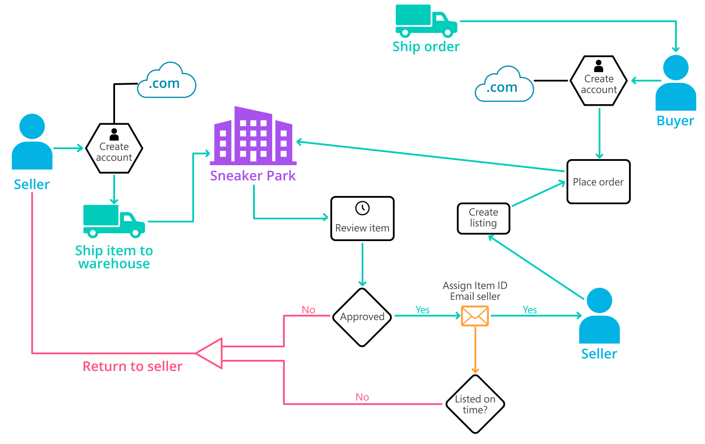
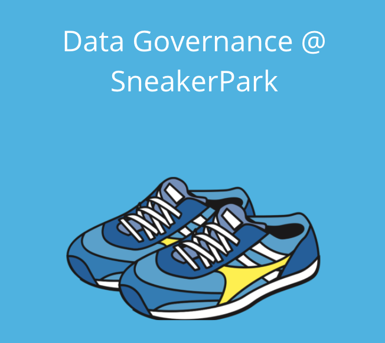
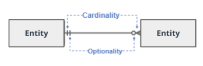
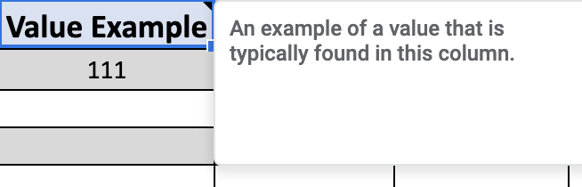

# Data Governance at Sneaker Park

## Business Background

SneakerPark is an online shoe reseller that allows people to buy and sell used and new shoes. Buyers can bid for shoes or buy them outright, and sellers can set a price or sell to the highest bidder.

Each buyer and seller must have an active account in order to sell, bid, or purchase sneakers using SneakerPark’s website.

SneakerPark authenticates the shoes before shipping them to the buyer, so before listing an item, the seller must ship it to SneakerPark’s warehouse. Upon receipt, SneakerPark assigns an item number to each pair of sneakers and notifies the seller that they are now free to list their item. If the item is not listed within 45 days, SneakerPark returns the sneakers to the seller and sends an invoice to the seller for the shipping cost.

If the item is found to be inauthentic or in an unacceptable condition, it is also returned back to the seller in a similar fashion.

When the item sells, the seller's account is credited with the purchase price minus the SneakerPark service fee and shipping fees to deliver the item to the buyer.

Currently, SneakerPark only supports sales within the United States.

Below you can see a diagram that will hopefully help you visualize some of SneakerPark's business processes. Keep in mind that it does not capture ALL processes and every nuance, but simply serves as another artifact to use in your project.

SneakerPark's business processes

### Motivation

SneakerPark’s business has grown rapidly over the past year and it has led to some growing pains. As the number of sellers, buyers, items, and sales increased, the company started running into discrepancies between systems which resulted in mischarges, lost revenue, and frustrated customers. With this in mind, Sneaker Park has decided to invest in an Enterprise Data Management program to gain better visibility and control over their data systems.

Phase 1 of this initiative focuses on creating the foundational data management tools and artifacts that will allow SneakerPark to better manage their data now and in the future. More specifically, this entails documenting SneakerPark's data systems, setting up a data catalog, designing better data quality and master data management processes, and formalizing data governance roles.

As a newly hired Data Architect, you are asked to technically lead the Enterprise Data Management Program and get started with the implementation of Phase 1.

The company plans to expand on this foundation in Phase 2 and build out an Enterprise Data Warehouse solution to replace the existing legacy data warehouse, MS Access databases, and excel reports. Phase 2 is a separate initiative and therefore is not a part of this project.

### Relevant Personnel

As part of the on-boarding process, you've been introduced to two employees that have been responsible for data management. The first of the two is a middle-aged man, named Jake. His background is in IT support and for the past two years, he has been tasked with administering the databases that are behind the company's systems. Even though he's been able to keep the databases running, he spends more and more time fire-fighting and trying to fix all the data issues that have come up.

The second is Jessica, a senior business analyst who is a company veteran and a subject-matter-expert when it comes to Sneaker Park's data. She has been instrumental in diagnosing data issues and finding solutions, but successful as she is, it has been increasingly difficult to keep up as she does this in addition to her other responsibilities.

Everybody is really excited that you're here and can't wait to see the results of your analysis, your recommendations, and your proposed solution. Good luck!

### Project Steps Overview

1. Create an Enterprise Conceptual Model that provide a holistic view of data in these three systems
1. Design the draft version of the Enterprise Data Catalog by documenting the metadata in an Excel spreadsheet.
1. Profile the data to identify 3 data quality issues. Create a document that lists each data quality issue, its description, and a suggested remediation strategy for each.
1. Design a data quality dashboard that will report on the issues you’ve identified above plus at least 1 more issue that you foresee might occur in the future.
1. Based on what you’ve read about SneakerPark’s systems and business model, sketch out a proposed MDM implementation architecture, and write a detailed explanation of why you chose this specific approach.
1. You will define a set of matching rules that will be used by SneakerPark's MDM Hub to match item and customer entities between the company's different systems.
1. Write a paragraph discussing what data governance roles and responsibilities will be necessary to oversee this new Data Management initiative.

## Technical Details

Some of the systems that SneakerPark relies on for its day-to-day operations are:

1. User Service which allows buyers and sellers to register an account with SneakerPark.com.
1. Inventory Management System which keeps track of the current inventory of sneakers in the warehouse.
1. Listing Service that allows sellers to create listings once their items have been approved.
1. Order Processing Service that processes orders and stores order details.
1. Customer Service Application that records customer support request information from customer service calls and emails.

These system's uptime (availability) requirements are as follows:

- User Service, Order Processing Service, and Customer Service Application are the most critical to SneakerPark's operation and must have an uptime of 99.999% (just 26 seconds of downtime per month).
- Listing Services can tolerate more downtime at 99.99% (roughly 9 seconds of downtime per day).
- Inventory Management Systems is the least critical and can tolerate even more at 99% (around 7 hours of downtime per month).

### Data

You are provided with the extract of the data from these systems in your workplace.

The extract will include 8 tables and 5 schemas (1 schema per system described above). Feel free to explore the data before getting to the project steps.

You've been told that the data broadly falls into the following Subject Areas: Customers, Inventory, Listings, Orders. (You take note of this because this will help you when you work on the Enterprise Data Model.)

### Governance

Even though there is little in the form of formalized data governance, SneakerPark has shared the following with you:

- Customer and Order data is highly confidential and is kept for 7 years unless a customer requests for this data to be deleted.
- All the other data is considered internal.
- Listing data is deleted after 2 years post expiration with the exception of some aggregated metrics that SneakerPark keeps for analytics purposes.
- Inventory data is kept current only with no historical tracking.

### Template and workspace

Due to rapid growth and the grassroots nature of the organization, SneakerPark has not created any formal documentation for their datasets until now.

The company has set you up with a new Postgres instance/workspace and a SQL client that you will use for this work. You can access the workspace here. A script file that contains the data has been added to the workspace.

To easily share with subject matter experts in the company, they've also provided you with a few templates to document your work. One is the project starter template where you will document your work. Another is the Sheets template for data dictionary and data quality issues.

While this is a high-value project, given the nature of SneakerPark’s business, it is important to note that it should be minimally disruptive to the operation of its critical systems (especially the Order Processing Service).

Sneaker Park Project Template

## Instructions

### Step 1: Metadata Management - Part 1

#### Part 1: Enterprise Data Model

Create a conceptual data model that will provide SneakerPark with a holistic view of its data systems and help you grasp the organization's important entities and relationships, which will be instrumental as you move further in the project.

Even though you will not be creating the full logical data model due to time constraints, please do include both cardinality (the type of a relationship such as 1 to many, 1 to 1, or many to many) and optionality (whether the relationship is optional or mandatory, 0 to 1 or 0 to many) in your model.

You can use Lucidchart or any other diagramming tool of your choice, but please use the Crow’s Foot/IE Notation.

Insert your model for Step 1 in the project template.

*Tip 1: A simple way to identify entities and relationships is to think in terms of parts of speech. Ask yourself - what are the nouns of the organization? These are your entities. What are the verbs? These are typically the relationships. So in the following sentence - “Professor teaches students”, professor and student would be entities and teaches would be the relationship.*

*Tip 2: See below for a diagram showing cardinality and optionality.* 

.

Optionality and cardinality

### Step 2: Metadata Management - Part 2
#### Part 2: Enterprise Data Catalog

Create the first version of the Metadata Catalog by documenting the metadata from all 5 systems in the "Data Dictionary" and "Business metadata" tabs of the provided Sheets template.

Make sure the precision or length is specified in the data type where appropriate.

Make sure your answer covers all 8 tables when filling the "Enterprise Data Catalog" tab.

Please note that you are required to fill out all fields in both tabs.

Attach the finished document to your final submission.

*Tip: The template has notes/comments for most columns to help you with filling out the information (see below for an example).*

Example note/comment for a column

